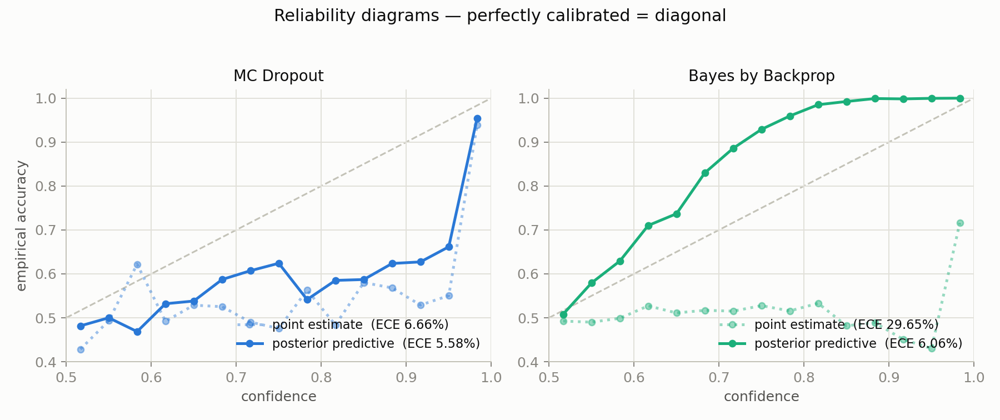
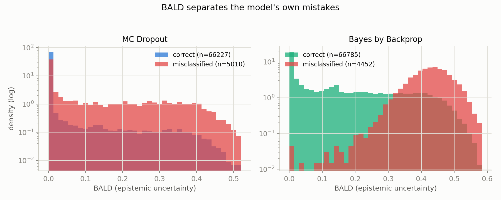
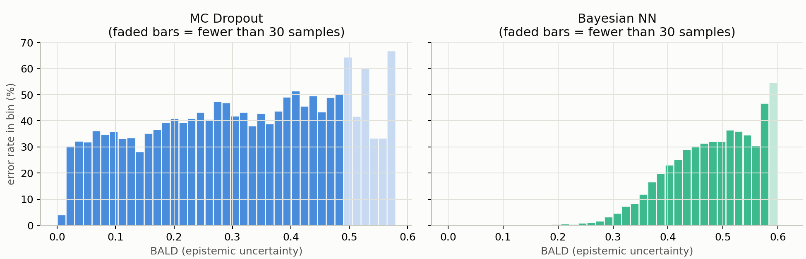

# AudioDetector — Probabilistic spoofed-speech detection on ASVspoof 2019 LA

Two uncertainty-aware audio spoofing detectors with the **same CNN backbone**,
compared with proper probabilistic metrics:

| Model | File | Uncertainty mechanism |
|---|---|---|
| **MCD** — MC Dropout | `mcd_model.py` | Dropout kept active at inference  |
| **BayesNN** — Bayes by Backprop | `bayes_model.py` | Every conv/linear weight is N(μ,σ²), trained with the ELBO 

Shared backbone: SE-ResNet-style encoder over 80-mel Whisper spectrograms,
frequency pooling + mean/std stats pooling over time, small FC head (~3.8M
effective weights; the BayesNN stores 2× parameters because each weight keeps μ and ρ).

## Repository layout

```
analyze.py      merges evaluation shards, computes summary metrics, writes plots
evaluate.py     runs point-estimate / MC evaluation for one checkpoint
extract.py      Whisper-tiny mel-spectrogram feature extraction (ASVspoof2019 LA)
mcd_model.py    MCDC (MC Dropout) model definition
bayes_model.py  BayesNN (Bayes by Backprop) model definition
train_mcd.py    MCDC training loop (hyperparameters set at the bottom of the file)
train_bayes.py  BayesNN training loop (CLI args, resumable/chainable — see below)
metrics.py      EER, NLL, BALD
utils.py        shared helpers
scripts/        SLURM job scripts + get_data.sh
results/        evaluation outputs (plots, per-utterance CSVs) — generated
runs/           TensorBoard event logs — generated
```

## Setup

```bash
python3 -m venv venv && source venv/bin/activate
pip install -r requirements.txt
```

Training was run on a SLURM cluster with V100 GPUs; `train_mcd.py` also runs
on CPU/MPS (with automatic mixed precision disabled) for local smoke-testing,
just slower. The `scripts/*.sh` files are SLURM batch scripts — if you don't
have SLURM, call the underlying `python train_bayes.py ...` / `python
evaluate.py ...` commands directly with the same arguments (drop the
`#SBATCH` headers and the `sbatch`/`source .../activate`/`module load cuda`
lines).

## Metrics (`metrics.py`)

- **EER** — standard ASVspoof countermeasure metric (score = prob(bonafide)).
- **ECE** — Expected Calibration Error, 15 equal-width confidence bins.
- **NLL** — proper scoring rules.
- **BALD** — H[E[p]] − E[H[p]] over posterior samples = epistemic uncertainty.


Each model is evaluated in two modes:
1. **point estimate** — deterministic pass (MCDC: dropout off; BayesNN: μ weights);
2. **posterior predictive** — mean softmax over 30 stochastic passes
   (MCDC: dropout masks; BayesNN: weight samples).

The det-vs-MC gap isolates what posterior marginalization buys (mainly
calibration); the MCDC-vs-BayesNN gap compares the two approximate posteriors.

Note: `MCDC.mc_predict` freezes BatchNorm (`eval()`) and re-enables only the
dropout layers — running the whole net in `train()` mode would make predictions
depend on batch composition through the BN batch statistics.

## Pipeline

Data prep: `scripts/get_data.sh` downloads and unzips the ASVspoof2019 LA
dataset from Zenodo, then `extract.py` pre-computes Whisper-tiny mel features
for the train split into `LA/features/train`. Validation uses a balanced
~12k-utterance subset of the dev protocol (`LA/ASVspoof2019.LA.cm.dev.subset.txt`).

All GPU work runs through SLURM (account limit: **2h per job**, so long work is
chunked):

```bash
# 1. Train BayesNN — self-chaining jobs, 8 epochs each, auto-resume from
#    bayes_last.pt until epoch 40 (writes bayes.done at the end)
sbatch run_bayes_train.sh

# 2. Evaluate on the LA eval set (71k utterances) — 4 parallel shards
for i in 0 1 2 3; do sbatch run_eval.sh mcdc  mcdc_epoch36.pt $i 4; done
for i in 0 1 2 3; do sbatch run_eval.sh bayes bayes_best.pt  $i 4; done

# 3. Merge shards, compute all metrics, produce plots (login node, no GPU)
python3 analyze.py \
    --csv "mcdc=results/mcdc_shard*_eval.csv" \
          "bayes=results/bayes_shard*_eval.csv" \
    --out_dir results
```

`analyze.py` writes into `results/`:
`summary.csv`/`summary.md` (all scalar metrics), `reliability.png`,
`bald_hist.png` (BALD for correct vs misclassified), `risk_coverage.png`,
`eer_per_attack.png` (A07–A19 breakdown).

## Training details worth reporting

- **ELBO**: mean cross-entropy + β·KL with β = 1/N_train, plus a linear **KL
  warm-up** over the first 5 epochs (without it the KL term crushes the
  likelihood before the net learns anything).
- **weight_decay = 0** for BayesNN — the KL to the N(0,1) prior *is* the
  regularizer; L2 on μ would double-penalize.
- Class imbalance (1 real : 8.8 fake in the train subset) handled with
  inverse-frequency class weights in both models.
- Mixed precision on the forward pass only; the KL is computed in fp32.

## Final results (LA eval set, 71,237 utterances, 30 MC samples)

MCDC = `mcdc_epoch36.pt`; BayesNN = `bayes_epoch12.pt`, selected by 10-sample
MC EER on the dev subset (single-sample val EER proved far too noisy to select by).

| model | mode | EER% | ECE% | NLL | mean BALD |
|---|---|---|---|---|---|
| MCDC  | point estimate | 4.09 | 6.66 | 0.629 | – |
| MCDC  | posterior pred. | **3.99** | 5.58 | 0.405 | 0.091 |
| Bayes | point estimate (μ) | 9.23 | 29.6 | 1.330 | – |
| Bayes | posterior pred. | 7.94 | 6.06 | **0.174** | 0.180 |

Balanced accuracy (mean of per-class recalls at threshold 0.5) matters because
the always-say-spoof baseline already gets 89.7% plain accuracy on the 1:8.7
imbalanced protocol. It also exposes the operating point: BayesNN's balanced
accuracy is low at 0.5 because its underconfident scores put its natural
threshold near 0.31 (see the EER threshold column) — a threshold-choice issue,
not a discrimination issue, which is why EER (threshold-free) stays the
primary metric.

Headline findings (plots in `results/`):
- **Discrimination**: MC Dropout wins on EER (4.0% vs 7.9%) — the ELBO is a
  harder optimization problem and the variational posterior underfits.
- **Probabilistic quality**: BayesNN wins on the proper scoring rule (NLL
  0.17 vs 0.41) and is *underconfident* where MCDC is
  *overconfident* (reliability.png) — the safer failure mode.
- **Marginalization is essential for BBB**: the μ point estimate is a bad,
  wildly miscalibrated classifier (ECE 30%) — the mean of the weights is not
  the mean of the functions. For MCDC the det/MC gap is small.


### Plots

| Reliability diagram | BALD: correct vs. misclassified | Error rate by confidence bin |
|---|---|---|
|  |  |  |


